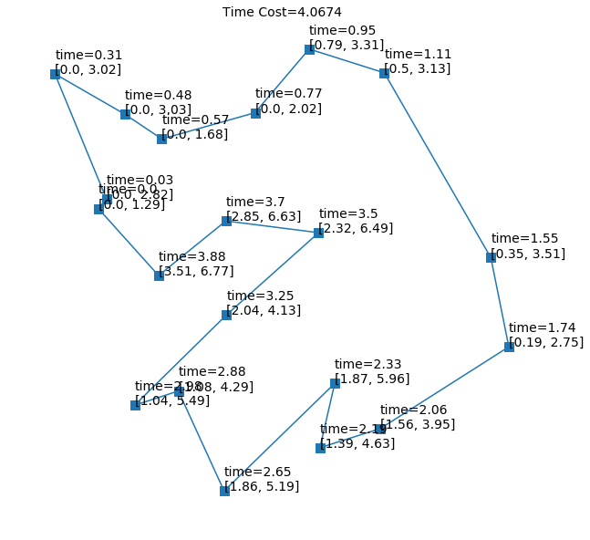

# Hierarchical Reinforcement Learning for Combinatorial Optimization

Solve combinatorial optimization problem with hierarchical reinforcement learning (RL) approach.

## Pointer-Net-Reproduce
Reproduce the result of pointer network.

See Pointer-Net-Reproduce.ipynb

## HRL-for-constrained-TSP
Solve TSP with constraints by hierarchical RL framework. The implemtation is based on pointer networks.

See GPN.ipynb, GPN_TSPTW.ipynb

## TBD
Full code will be released soon.

## Example 

